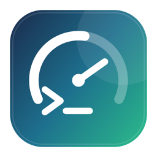

<p align="center">
  
</p>

<h1 align="center">Quota for Codex</h1>

<p align="center">
  在 macOS 菜单栏和桌面小组件中查看 Codex 剩余额度与最近 7 天用量。
</p>

<p align="center">
  <a href="README_EN.md">English</a> ·
  <a href="#安装">安装</a> ·
  <a href="#常见问题">常见问题</a> ·
  <a href="LICENSE">MIT License</a>
</p>

> Quota for Codex 是独立第三方开源项目，不隶属于 OpenAI。

## 功能

- 小号 Widget：显示 5 小时额度、周额度及重置时间。
- 中号 Widget：在额度信息右侧显示最近 7 天 token 用量柱状图。
- 菜单栏应用：查看同步状态、立即刷新和打开设置。
- 自动刷新：额度约每 60 秒检查一次，趋势约每 15 分钟更新一次。
- 登录时启动：可在设置中开启或关闭。
- 自动寻找 Codex：支持 ChatGPT/Codex 桌面应用内置版本、Homebrew 和 `PATH` 中的 CLI，也可手动选择。
- 本地优先：不读取或保存 Codex 登录凭证，不上传额度数据。

不同账号不一定同时提供 5 小时和周额度。缺失窗口会显示“暂无数据”，不会被误报为 100%。

## 系统要求

- macOS 14 Sonoma 或更高版本。
- 已安装并登录 ChatGPT/Codex 桌面应用，或已登录 Codex CLI。
- 从源码安装时需要完整 Xcode 和 [XcodeGen](https://github.com/yonaskolb/XcodeGen)。

当前仓库暂未提供经过 Developer ID 公证的 DMG，因此首次安装需要从源码构建。

## 安装

### 1. 获取源码

```bash
git clone https://github.com/yuanjuju/QuotaForCodex.git
cd QuotaForCodex
```

### 2. 准备开发环境

1. 从 Mac App Store 安装完整 Xcode。
2. 打开 Xcode，在 `Settings -> Accounts` 中登录 Apple ID。
3. 安装 XcodeGen：

```bash
brew install xcodegen
```

### 3. 安装应用

```bash
./scripts/install-local.sh
```

脚本会自动生成工程、识别开发团队、完成签名，并安装到：

```text
~/Applications/Quota for Codex.app
```

如果自动识别失败，可以显式传入 Team ID：

```bash
APPLE_TEAM_ID='YOUR_TEAM_ID' ./scripts/install-local.sh
```

如果 Xcode 提示 Bundle Identifier 已被占用，先换成自己的反向域名标识，再重新安装：

```bash
./scripts/configure-identifiers.sh com.yourname
./scripts/install-local.sh
```

此操作会修改本地工程的 Bundle ID 和 App Group。请使用只包含英文字母、数字和点的唯一前缀。

### 4. 添加小组件

1. 启动 `Quota for Codex`，菜单栏会出现仪表图标。
2. 在桌面空白处右键，选择“编辑小组件”。
3. 搜索 `Quota for Codex`。
4. 选择小号或中号，然后拖到桌面。
5. 如需持续更新，在应用设置中打开“登录时启动”。

WidgetKit 的最终刷新时间由 macOS 调度。菜单栏数据通常会更快更新，桌面小组件不能保证秒级刷新。

## 使用方法

点击菜单栏图标可以：

- 查看 5 小时和周额度。
- 查看最后更新时间及当前连接状态。
- 点击“刷新”立即重新同步额度和趋势。
- 打开设置，测试连接或选择其他 Codex 可执行文件。
- 开启登录时启动。

额度颜色含义：

| 剩余额度 | 颜色 |
| --- | --- |
| 50%–100% | 绿色 |
| 20%–49% | 橙色 |
| 0%–19% | 红色 |

## 常见问题

### 显示“未安装”

先确认 ChatGPT/Codex 桌面应用或 Codex CLI 已安装。也可以在设置中点击“选择可执行文件”，手动选择 `codex`。

### 显示“未登录”

打开 ChatGPT/Codex 或在终端登录 Codex CLI，确认能够正常使用后，再点击菜单栏中的“刷新”。

### 小组件没有立即变化

菜单栏应用会立即请求 WidgetKit 刷新，但 macOS 可能延迟更新时间线。请保持菜单栏应用运行，并开启“登录时启动”。

### 安装时提示签名或 App Group 错误

确认已在 Xcode 登录 Apple ID。如果 Bundle ID 与其他开发者冲突，请运行：

```bash
./scripts/configure-identifiers.sh com.yourname
```

然后重新执行安装脚本。

### 免费 Apple ID 的签名过期

Personal Team 的开发签名会定期过期。重新运行 `./scripts/install-local.sh` 即可覆盖安装。

## 隐私与安全

应用通过本机的 `codex app-server --listen stdio://` 读取：

- `account/rateLimits/read`
- `account/usage/read`

额度快照只写入本机 App Group 容器，供主应用和 Widget Extension 共享。项目不会读取 `~/.codex/auth.json`，不会保存账号密钥，也没有自建云端服务。

## 开发

生成 Xcode 工程并运行完整测试：

```bash
./scripts/bootstrap.sh
```

只测试共享 Swift 包：

```bash
swift test
```

使用当前登录账号运行只读连接探针：

```bash
swift run QuotaProbe
```

运行不依赖真实账号的烟雾测试：

```bash
swift run QuotaSmoke
```

`project.yml` 是 Xcode 工程配置的来源。修改目标、签名或构建设置后，请运行：

```bash
xcodegen generate
```

更多工程约定请参阅 [agents.md](agents.md)，参与开发前请阅读 [CONTRIBUTING.md](CONTRIBUTING.md)。

## 工作原理

```text
本机 Codex 可执行文件
        ↓ stdio JSON-RPC
菜单栏主应用
        ↓ 原子 JSON 快照
   App Group 容器
      ↙       ↘
  菜单栏    WidgetKit
```

主应用负责 Codex 进程生命周期、轮询与错误处理；Widget Extension 只读取快照，不直接启动 Codex，也不接触登录凭证。

## 发布

维护者可使用 `scripts/release.sh` 构建 Universal 2、Developer ID 签名并公证的 DMG。需要 Apple Developer Program、Developer ID Application 证书和 notarytool profile。具体环境变量参见脚本。

## 已知限制

- WidgetKit 刷新受 macOS 调度限制。
- Codex app-server 协议未来可能变化。
- 当前只显示整体 `codex` 额度，不显示模型专属额度桶。
- 仅支持 macOS，不包含 iPhone/iPad、云同步、通知和自动更新。

## 许可证

本项目使用 [MIT License](LICENSE)。
