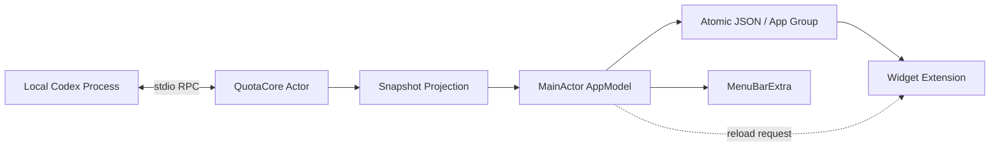

# Native Runtime & Snapshot Architecture

Quota for Codex 将本机进程通信、额度语义归一化与系统小组件展示拆分为三个边界：**runtime integration → snapshot projection → native presentation**。主应用持有连接与刷新任务，Widget Extension 消费持久化快照。

## Component boundaries

| 组件 | 职责 | 源码 |
| --- | --- | --- |
| Runtime discovery | 定位桌面应用内置或独立 CLI，支持自定义路径与版本探测 | [CodexExecutableLocator](../Sources/QuotaCore/CodexExecutableLocator.swift) |
| Actor-isolated transport | 子进程与管道生命周期、请求 ID、pending continuation、超时和事件流 | [CodexAppServerClient](../Sources/QuotaCore/CodexAppServerClient.swift) |
| Snapshot orchestration | 组织额度 / 用量读取，允许用量读取失败时保留历史曲线 | [CodexQuotaService](../Sources/QuotaCore/CodexQuotaService.swift) |
| Semantic projection | 选择整体额度桶、规范窗口、七日桶聚合与补零 | [QuotaMapper](../Sources/QuotaCore/QuotaMapper.swift) |
| Cross-process persistence | App Group 内 Codable JSON 的原子写入与读取 | [SnapshotStore](../Sources/QuotaCore/SnapshotStore.swift) |
| Host lifecycle | 轮询、事件刷新、唤醒恢复、错误状态与时间线更新请求 | [AppModel](../Sources/QuotaApp/AppModel.swift) |
| System presentation | 快照读取、stale 检查、小号与中号 Widget 时间线 | [QuotaWidget](../Sources/QuotaWidget/QuotaWidget.swift) |

共享 Swift Package 不依赖 SwiftUI 或 WidgetKit；菜单栏和 Widget targets 复用其模型、映射与存储逻辑。Xcode 工程以 `project.yml` 为配置来源，核心逻辑可以独立执行 `swift test`。

## Concurrency and ownership

- `CodexAppServerClient` 是 actor，集中管理连接状态和请求表。管道 reader 使用独立 Task，将解析后的消息交回 actor。
- 每个请求拥有递增整数 ID 与一个 checked continuation。响应、超时、写入失败和断连通过移除 pending 项结束请求；迟到响应不会重新恢复已经移除的 continuation。
- 服务器通知映射为 `AsyncStream<CodexEvent>`。主应用收到额度变更后重新读取完整快照，不把通知参数当作局部数据补丁。
- `AppModel` 运行在 MainActor，`isRefreshing` 防止同时进入多个 UI 刷新流程；它不构成跨进程分布式锁。
- 主应用负责启动本地 Codex，Widget 不启动子进程，也不读取登录凭据。仓库没有自建远程数据收集服务。

完整握手与请求时序见 [Protocol & Lifecycle](protocol.md)。

## Snapshot contract

持久化模型包含 `schemaVersion`、`fetchedAt`、`sourceVersion`、`windows`、`dailyUsage`、`status` 和 `statusMessage`，定义在 [Models.swift](../Sources/QuotaCore/Models.swift)。

| 字段 | 语义 |
| --- | --- |
| `usedPercent` | 已使用百分比；构造模型时限制到 0–100 |
| `remainingPercent` | 由 `100 - usedPercent` 计算，不单独持久化 |
| `durationMinutes` | 区分 5h、Week 或其他窗口；缺失时保留未知状态 |
| `dailyUsage` | 按本地日历形成最近七天，重复桶相加、缺失日补零 |
| `fetchedAt` | 整份快照的刷新时间；不是每条数据各自的采样时间 |
| `schemaVersion` | 当前写入版本字段；现有读取路径没有完整迁移引擎 |

`rateLimitsByLimitId["codex"]` 优先于 legacy `rateLimits`；模型专属桶不进入当前界面。日用量查询失败时，额度读取仍可成功，曲线则沿用之前的数据。当前没有单独的 usage freshness 字段，不能把一次额度刷新理解为曲线也已更新。

存储使用 Foundation `.atomic` 写入，减少读到部分 JSON 的机会。App Group 提供共享容器，Widget 通过独立进程读取；这是一种单写入方的文件快照交换方式。它没有引入数据库、订阅日志或跨设备同步。

## Refresh and staleness

| 触发源 | 当前实现 |
| --- | --- |
| 成功后的后台循环 | 约 60 秒后再次检查额度 |
| 日用量 | 首次、手动强制或距离上次使用刷新达到约 15 分钟时读取 |
| 额度变更通知 | 发起完整刷新 |
| macOS 唤醒 | 请求额度与用量刷新 |
| 失败 | 停止服务并按等待表重试；保留已有可展示数据 |
| stale | `fetchedAt` 超过 30 分钟，按现有状态判断显示缓存数据 |
| Widget timeline | 默认建议约 15 分钟后刷新，临近窗口重置时可提前请求 |

重连等待表为 `[1, 2, 5, 15, 60]` 秒，但失败计数在选择索引前递增，普通首次失败通常使用 2 秒项；事件与错误路径也可能影响计数。这里按实现解释，不宣称每次严格按五档顺序执行。

主应用仅在窗口、曲线或同步状态变化时请求刷新时间线。WidgetKit 是否立即执行由 macOS 决定，菜单栏轮询频率不等于 Widget 实际更新频率。

## Validation and distribution

验证区分核心协议测试、离线 smoke、主应用 / Widget 编译和最终分发。详情见 [Verification Record](verification.md)。仓库提供 Developer ID 签名、公证与 DMG 构建脚本；脚本存在不表示已经提供经过公证的公开发布包。
