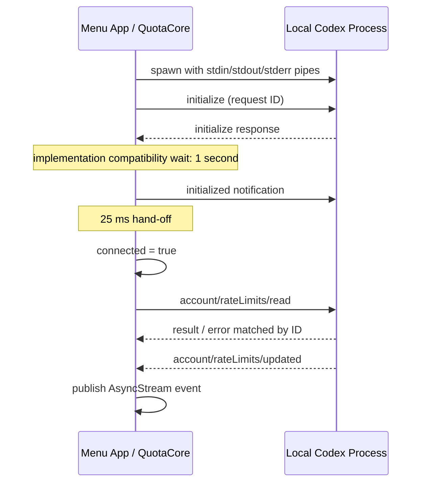

# Protocol & Request Lifecycle

本文描述 [CodexAppServerClient](../Sources/QuotaCore/CodexAppServerClient.swift) 当前实现的通信方式。客户端与已安装的本机 `codex app-server --listen stdio://` 交互，账户接口的可用性取决于所安装版本。

## Session initialization



初始化等待是当前兼容性处理，不是协议定义的通用时间保证。连接失败时进入 `disconnect()`，关闭管道并结束未完成请求；正常调用在需要时通过 `ensureConnected()` 重新建立连接。

## Request correlation

```text
encode request
  → allocate monotonically increasing ID
  → register CheckedContinuation in pending[id]
  → write newline-delimited JSON
  → await matching result or terminal condition
```

stdout reader 按换行分帧并缓冲跨 read 的残留数据。JSON 携带 ID 时优先匹配请求；`error` 转换成 `RPCRemoteError`，`result` 解码为调用端所需类型。通知通过 method 区分，当前处理 `account/rateLimits/updated`。

| 终止条件 | pending 处理 | 调用方观察 |
| --- | --- | --- |
| 成功响应 | 移除相应 ID | 解码后的 response |
| 远端 error | 移除相应 ID | `RPCRemoteError` |
| 写入失败 | 移除相应 ID | write error |
| 请求超时 | 若 ID 仍存在则移除 | `requestTimedOut(method)` |
| disconnect / process EOF | 清空请求表 | `processExited` |
| 已结束请求的迟到响应 | 找不到 pending 项 | 不重复完成已结束请求 |

默认请求期限为 15 秒，初始化可以单独指定期限。当前超时处理结束的是本地等待，没有向远端发送逐请求取消消息。已成功请求对应的 timeout Task 仍可能稍后醒来，发现 ID 已移除后退出。应用级任务取消与传输层请求取消也不是同一机制。

## Service-level partial failure

`CodexQuotaService.fetchSnapshot` 在需要更新趋势时，并发读取额度与日用量。额度是必要结果，日用量通过可选结果处理失败，因此可以保留上次曲线。主应用读取失败后保留已有快照的窗口和用量，只更新失败状态；下一次成功读取恢复 ready。

## Protocol coverage

现有测试用独立的 fake executable 模拟 stdio server，覆盖初始化、额度响应、用量响应、通知与请求超时。它们不访问真实账号。

尚未自动验证的路径包括多个并发请求乱序返回、截断 / 非法报文、EOF 期间的并发请求、重新连接竞争以及任务取消传播。把这些列为后续协议测试目标；不能从一次成功的 fake-server 交互推导所有异常路径均正确。
